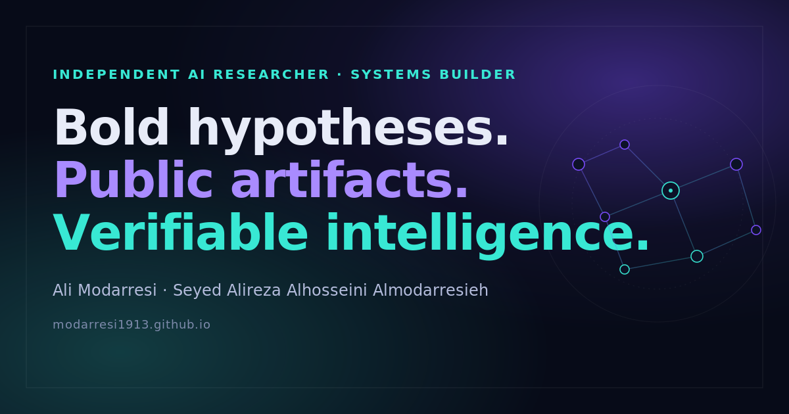

<div align="center">



# Ali Modarresi
### Independent AI Researcher & Systems Builder

**Bold hypotheses · Public artifacts · Verifiable intelligence**

[](https://modarresi1913.github.io/)
[](https://pages.github.com/)
[](#)
[](#)
[](#)
[](#license)

</div>

---

> **A distinctive, credible, fast, accessible personal research website.**
> Not another AI-influencer template. No fake dashboards, no neon noise, no
> invented metrics — just open specifications, public artifacts, and falsifiable ideas.

---

## ✦ Why this site is different

| Most "AI researcher" sites | This site |
|---|---|
| Stock robot illustrations, glassmorphism overload | Quiet research-studio aesthetic: deep navy, violet, restrained cyan |
| Walls of identical cards, no hierarchy | Editorial typography, spacious layout, one clear idea per section |
| Claims of "solved alignment", "production-ready", "Nobel-nominated" | Every claim grounded in a real repository README |
| Hidden Jekyll/Next build, breaks without JS | Plain HTML/CSS/vanilla JS — **works with JS disabled** |
| Analytics, tracking pixels, cookie banners | **Zero**. No analytics, no cookies, no third-party scripts |
| Fabricated publication lists | Honest link to DEV.to profile; no invented article metadata |
| "AI citation guarantee" snake oil | Explicit statement that no such guarantee is claimed |

---

## ✦ Live

Once GitHub Pages is enabled (3-minute setup — see [Deploy](#-deploy)):

```
https://modarresi1913.github.io/
```

Preview locally — no build step:

```bash
python3 -m http.server 8080
# → open http://localhost:8080/
```

---

## ✦ Table of contents

- [Why this site is different](#-why-this-site-is-different)
- [Live](#-live)
- [File structure](#-file-structure)
- [Design language](#-design-language)
- [Content integrity](#-content-integrity)
- [Maintain](#-maintain)
  - [Preview locally](#preview-locally)
  - [Edit the bio](#edit-the-bio)
  - [Add or update a project](#add-or-update-a-project)
  - [Add writing links](#add-writing-links)
  - [Replace the Crazy AI logo](#replace-the-crazy-ai-logo)
  - [Update social metadata](#update-social-metadata)
- [Deploy](#-deploy)
- [Known limitations](#-known-limitations)
- [License](#license)

---

## ✦ File structure

```
modarresi1913.github.io/
├── index.html                  ← Homepage (hero · directions · selected work · approach · collab)
├── projects/
│   └── index.html              ← All 6 verified projects with repo-grounded maturity
├── research/
│   └── index.html              ← 3 directions, limitations, open questions
├── writing/
│   └── index.html              ← Honest DEV.to link, no fabricated articles
├── about/
│   └── index.html              ← Conservative bio · full name · Crazy AI scoped
├── 404.html                    ← Accessible not-found page
├── assets/
│   ├── css/styles.css          ← Design tokens + components (~600 lines)
│   ├── js/main.js              ← ~60 lines vanilla JS (nav toggle · focus mgmt)
│   └── images/
│       ├── brand-mark.svg      ← Navbar wordmark
│       ├── motif.svg           ← Hero "graph of ideas" illustration
│       └── social-preview.png  ← 1200×630 OG / Twitter card
├── robots.txt                  ← Crawl rules + sitemap reference
├── sitemap.xml                 ← 5 top-level pages
├── .nojekyll                   ← Skip Jekyll processing on GitHub Pages
└── README.md                   ← This file
```

---

## ✦ Design language

| Token | Value | Used for |
|---|---|---|
| Background | `#070b18` near-black navy | Site backdrop, ambient wash |
| Surface | `#0c1226` | Cards, project panels |
| Primary text | `#e8ecf8` | Body copy, headlines |
| Violet accent | `#7c4dff` | CTAs, links, key nodes |
| Cyan accent | `#38e8d4` | Eyebrows, highlights, "core" nodes |
| Body font | Inter / system-ui | UI text |
| Display font | Source Serif Pro / Georgia | Headlines, project names |
| Mono font | JetBrains Mono / SF Mono | Tags, repo links, meta |

**Motion principle:** subtle, purposeful, never blocking. All animations gated behind `@media (prefers-reduced-motion: no-preference)`. The hero motif is the only ambient motion — a single pulsing node — and it freezes entirely under reduced-motion.

**Accessibility commitments:** skip-link on every page, single `<h1>` per page, semantic landmarks, visible keyboard focus, all decorative SVGs `aria-hidden`, all informative SVGs have `role="img"` + `aria-label`, 44px touch targets, no hover-only content, no autoplay.

---

## ✦ Content integrity

Every factual claim on this site is **grounded in a real, fetched artifact**. Nothing is invented.

| Claim type | Status |
|---|---|
| Project descriptions | ✅ Quoted from each repo's `README.md` (fetched at build time) |
| Maturity labels | ✅ Verbatim from repo badges/status sections |
| Public profile links | ✅ Reachable at build time (HTTP 200) |
| Full name | ✅ Confirmed by owner |
| Degrees / awards / affiliations | ❌ None claimed |
| Stars / followers / citations | ❌ None claimed |
| Peer-review status | ❌ None claimed |
| "Solved consciousness / alignment" | ❌ Explicitly disclaimed |
| "AI citation probability improved" | ❌ Explicitly disclaimed |

---

## ✦ Maintain

### Preview locally

```bash
# Option 1 — Python (installed on most systems)
python3 -m http.server 8080

# Option 2 — Node.js
npx serve .

# Option 3 — just open index.html (some browsers restrict file://)
```

### Edit the bio

| Location | File |
|---|---|
| Homepage hero copy | `index.html` → `<section class="hero">` |
| Canonical bio | `about/index.html` |
| Footer identity block | every page (intentionally duplicated — no build step) |

The full name **Seyed Alireza Alhosseini Almodarresieh** appears in: footer (every page), About page, JSON-LD `Person.alternateName`. Use the same spelling everywhere.

### Add or update a project

1. **Read the actual repo README first.** Do not invent maturity or status.
2. Open `projects/index.html`, copy an existing `<article class="project-card">` block.
3. Update `<h3>`, subtitle, badges, repo URL, description, problem statement, maturity label.
4. If featured on homepage, add a matching `<article class="work">` block in `index.html` under `#selected-work`. Homepage intentionally shows 3.
5. `sitemap.xml` only needs updating if you add a brand-new top-level page — individual project entries don't have their own URLs.

### Add writing links

The Writing page links to the DEV.to **profile**, not to individual articles. To add a specific article:

1. **Read the article first.**
2. In `writing/index.html`, add a new `<h2>Selected articles</h2>` section with: exact title, canonical URL, honest one-line description. Do not invent dates or reading times.

### Replace the Crazy AI logo

No Crazy AI logo currently exists. To add an approved one:

1. Place `assets/images/crazy-ai-logo.svg` (preferred) or `.png`.
2. In each page's footer `.crazy-ai` block, add an `` with descriptive `alt` (e.g. `"Crazy AI exploratory research identity mark."`).
3. Constrain size with explicit `width`/`height` (e.g. 40×40) so it cannot be stretched.
4. Keep it in the footer — **never promote it to the hero**.
5. Never claim Crazy AI is a company, lab, or organization.

### Update social metadata

Each page has its own `<title>`, `<meta name="description">`, canonical URL, and Open Graph / Twitter tags in `<head>`. Shared `og:image` is `assets/images/social-preview.png` (1200×630 PNG).

To regenerate the preview: edit `scripts/social-preview.svg` (kept in the build project) and re-render with `cairosvg`. PNG is preferred over SVG for `og:image` because browser/scraper support is broader.

JSON-LD blocks live at the bottom of each `<head>`:
- `index.html` — `Person` + `WebSite`
- `projects/index.html` — `CollectionPage` with `SoftwareApplication`/`CreativeWork` items
- `about/index.html` — `AboutPage`
- `research/index.html` — `ProfilePage`

**Never add** fictional credentials, affiliations, awards, or publications to structured data.

---

## ✦ Deploy

**3-minute setup, no CI/CD required.**

1. Push the contents of this repository to `main` on `modarresi1913/modarresi1913.github.io`.
2. GitHub → **Settings → Pages → Build and deployment**.
3. Source: **Deploy from a branch** · Branch: **`main`** · Folder: **`/ (root)`** → Save.

The site goes live at <https://modarresi1913.github.io/> within ~1–2 minutes.

The `.nojekyll` file at the repo root tells GitHub Pages to serve files as-is, skipping Jekyll processing. **Do not delete it.** No GitHub Actions workflow is needed — don't add one unless you have a specific reason.

---

## ✦ Known limitations

- **No contact form.** Would require a backend or third-party service. LinkedIn DMs or repo issues are the recommended channels.
- **No analytics.** By design. None is added.
- **No build pipeline.** By design — the site is plain HTML/CSS/JS so it remains maintainable by anyone and works with JavaScript disabled.
- **Project descriptions can drift.** Each description was written after reading the repo's README at build time. Repos can change. If a description diverges, open an issue or PR.
- **No verified article list.** The Writing page links to the DEV.to profile rather than reproducing metadata that has not been verified.
- **SVG social preview limitation.** `og:image` is PNG (most widely supported). The SVG source is preserved in the build project, not in this repo.
- **No live deployment was performed by the author of this README.** The repository contains the complete, ready-to-deploy site; enabling GitHub Pages is the only remaining step.

---

## License

The website source (HTML, CSS, JS, SVG) is offered for the owner's use. Each referenced project is under its own license — see the individual repositories.

<div align="center">

© Ali Modarresi · Seyed Alireza Alhosseini Almodarresieh

*Bold hypotheses · Public artifacts · Verifiable intelligence*

</div>
